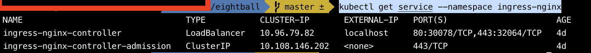
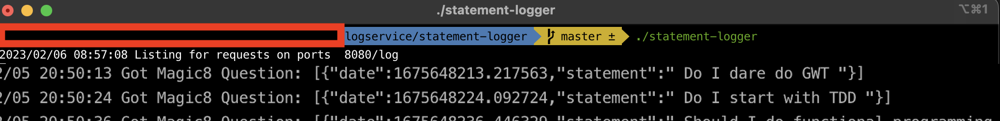

# FluentBit - Log Filtering and HTTP Forwarding 

TLDR:
Simple walk through for Fluent Bit Log Filtering and HTTP Forwarding on a Kubernetes cluster.

Code: https://github.com/MalcolmPereira/eightball

**Versions**:

        Ingress-nginx: 1.5.1

        Fluent Bit: 2.0.8


## What is FluentBit

[Fluent Bit](https://fluentbit.io) is an end to end observability pipeline and as stated in Fluent Bit vision statement - “Fluent Bit is a super fast, lightweight, and highly scalable logging and metrics processor and forwarder. It is the preferred choice for cloud and containerized environments.” 

In essence if you want to aggregate logging and metrics in a cloud environment and have separate systems for visualizing logs and metrics FluentBit is your go to choice.

[Fluent Bit Documentation](https://docs.fluentbit.io/manual) is succinct to get you started for different use cases.

Fluent Bit data pipeline consists of plugins to manipulate and route data to output destinations which includes following plugin categories:

- Input
  - Input plugins that allow to source data from various sources  

- Parser
  - Parsers that allow to parse and input data and convert from unstructured to structured format

- Filter
  - Filters that allow to filter, modify and enrich data.    

- Router
  - Create routing rules around the data

- Output
  - Output plugins that connect the data to various output sources


Please checkout [Fluent Bit Documentation](https://docs.fluentbit.io/manual) for further details.


## Sample Application - Magic 8 Ball

Naive Implementation for [Eight Ball](https://en.wikipedia.org/wiki/Magic_8-Ball) 

Simple project that answers responses to questions that results in a "yes" or "no" answers.

This is nothing new, Magic Eight Ball was invented in 1950 by Albert C. Carter and Abe Bookman and later manufactured by a leading toy company.

The application consists of a front end React Web Application that calls Magic8 REST API which returns predictions for statements entered in the web application. 

Fluent Bit parses logs generated by REST API service, filters lines containing "statement" and sends it to a service that captures  statements.

The aim of  the application is to demonstrate setting up fluent bit for parsing logs and routing filtered logs to an output destination.


## Fluent Bit Configuration

Fluent Bit is installed via helm using definitions in fluent-bit-values.yaml file, some important sections in yaml file are as follows.

- The input section tails Magic8 Service logs.

```yaml
...
...
 inputs: |
    [INPUT]
        name tail
        path /var/log/containers/magic8service*.log
        tag kube.*
        multiline.parser docker,cri
        read_from_head true
        buffer_chunk_size 3MB
        buffer_max_size 5MB
        mem_buf_limit 5MB
        skip_long_lines Off
   
....
...
```

- The filter parser filters out log lines that do not have STATEMENT string in the log lines.

```yaml
....
 [FILTER]
        name   grep
        match  *
        regex  log STATEMENT
....
```

- Another filter parser extracts the statement using [Rubluar Regular Expression](https://rubular.com) to parse statement item from the log.

```yaml
...
...
   [FILTER]
        name parser
        parser magic8-parser
        match kube.*
        key_name log
        preserve_key true
        reserve_data true
        match kube.*
...
...
...
 customParsers: |
    [PARSER]
      name magic8-parser
      format regex
      regex \STATEMENT:(?<statement>([ a-zA-Z0-9]*))
...
...      
```

- Another filter removes elements from log lines which are not required by statment capturing service.

```yaml
....
    [FILTER]
        name modify
        match *    
        Remove_wildcard date
        Remove_wildcard log
        Remove_wildcard log_processed
        Remove_wildcard kubernetes
        Remove_wildcard stream
        Remove_wildcard time
....        
```

Finally output plugin routes statements t0 a logging service. The logging service is running some reachable address e.g. 10.0.0.182 

```yaml
....
    [OUTPUT]    
        name http
        match *
        host 10.0.0.182
        port  8080
        uri   /log
        format json
        body_key ${statement}
...
...        
```


## Install on a local Kubernetes cluster

All commands executed from the root of the project. 

This is very easy with [DockerDestop](https://www.docker.com/products/docker-desktop/) or [Rancher Desktop](https://rancherdesktop.io). Please disable default Traefik Ingress Controller with Rancher Desktop or adjust the Magic8 Ingress to work with Traefik.


### Generate SSL Certificates

Please install [CloudFlare SSL Tools](https://github.com/cloudflare/cfssl) for generating test SSL certificates, very easy on mac with brew install cfssl, other systems supported as well.

Generate SSL Certificates for REST API

```shell
cfssl gencert -ca tls/myaceme_ca.pem -ca-key tls/myaceme_ca-key.pem -config tls/profile.json -profile=server tls/service_tls/magic8service.json | cfssljson -bare tls/service_tls/magic8service
```

Generate SSL Certificates for Web Application

```shell
cfssl gencert -ca tls/myaceme_ca.pem -ca-key tls/myaceme_ca-key.pem -config tls/profile.json -profile=server tls/client_tls/magic8client.json | cfssljson -bare tls/client_tls/magic8client
```

### Install Kubernetes Ingress-Nginx Ingress Controller

The ingress allows for consistent access to the services running in the cluster.


```shell

helm repo add ingress-nginx https://kubernetes.github.io/ingress-nginx

helm repo update

##Ingress-NGINX Version 1.5.1, Helm Chart Version 4.4.2
helm upgrade --install ingress-nginx ingress-nginx/ingress-nginx --version 4.4.2 --namespace ingress-nginx --create-namespace

```

Please validate that an valid IP address is shown for the ingress controller.

```shell
  kubectl get service --namespace ingress-nginx
```




Update the Host file to make the following addresses resolvable by localhost or a specific ip address as displayed by the Ingress service.

``shell
::1             magic8client.malcolm.io
::1             magic8service.malcolm.io
```
or 

```shell
10.0.0.169      magic8client.malcolm.io
10.0.0.169      magic8service.malcolm.io
```

### Install Application

Create magic8 namespace.

```shell
kubectl create namespace magic8

namespace/magic8 created
```

Create TLS secrets for the ssl certificates.

```shell

kubectl create secret tls service-ingress-tls --key tls/service_tls/magic8service-key.pem --cert tls/service_tls/magic8service.pem --namespace magic8  

kubectl create secret tls client-ingress-tls --key tls/client_tls/magic8client-key.pem --cert tls/client_tls/magic8client.pem --namespace magic8

```

Apply magic8 deployments.

```shell

kubectl apply -f service/node/magic8/magic8service.yaml --namespace magic8

kubectl apply -f client/react/magic8/magic8client.yaml --namespace magic8
```

### Install Fluent Bit

Install fluent bit using the fluend helm repo.

```shell
#Add Fluent Bit Helm Repo 
helm repo add fluent https://fluent.github.io/helm-charts

#Update the repo  
helm repo update

#Install Fluent Bit
#Using Helm Chart Version 0.23.0 which is fluent-bit version 2.0.8
#Use the fluent-bit-values.yaml values file
helm upgrade --install fluent-bit fluent/fluent-bit --version 0.23.0 --values fluentd/fluent-bit-values.yaml --namespace magic8
```    

### Run Statement Logger Service

The statment logger service is a simple go http server that logs the statements to the console.





Access the web application at https://magic8client.malcolm.io for the magic8ball application and see entered statements logged in statement logger service through Fluent Bit.


### Clean Up.

```shell

helm uninstall fluent-bit --namespace magic8

kubectl delete -f service/node/magic8/magic8service.yaml --namespace magic8

kubectl delete -f client/react/magic8/magic8client.yaml --namespace magic8

kubectl delete secret service-ingress-tls --namespace magic8  

kubectl delete secret client-ingress-tls --namespace magic8

kubectl delete namespace magic8

helm uninstall ingress-nginx --namespace ingress-nginx

```

Hope you found this walk through helpful and have a general idea on how Fluent Bit can be used. Thank you for reading.
